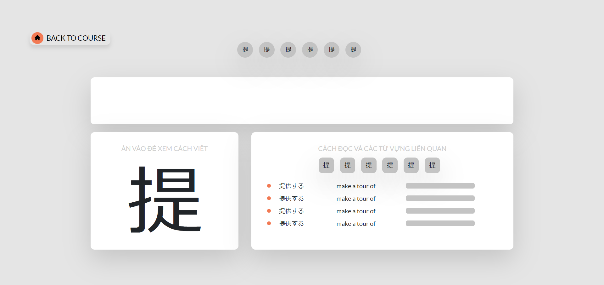

<!--
*** Thanks for checking out the Best-README-Template. If you have a suggestion
*** that would make this better, please fork the repo and create a pull request
*** or simply open an issue with the tag "enhancement".
*** Thanks again! Now go create something AMAZING! :D
-->

<!-- PROJECT SHIELDS -->
<!--
*** I'm using markdown "reference style" links for readability.
*** Reference links are enclosed in brackets [ ] instead of parentheses ( ).
*** See the bottom of this document for the declaration of the reference variables
*** for contributors-url, forks-url, etc. This is an optional, concise syntax you may use.
*** https://www.markdownguide.org/basic-syntax/#reference-style-links
-->

[![Contributors][contributors-shield]][contributors-url]
[![Forks][forks-shield]][forks-url]
[![Stargazers][stars-shield]][stars-url]
[![Issues][issues-shield]][issues-url]
[![MIT License][license-shield]][license-url]
[![LinkedIn][linkedin-shield]][linkedin-url]

<!-- PROJECT LOGO -->
<br />
<div align="center">
  <a href="https://sun-japanese-learning-git-master.namdo1012.vercel.app/">
    <div>
    
    </div>
    BT NIHONGO
  </a>

  <!-- <h3 align="center">Best-README-Template</h3> -->

  <p align="center">
    An awesome funniest Japanese learning website for you! 
    <br />
    <a href="https://github.com/namdo1012/IT4552-Project"><strong>Check our source codes!</strong></a>
    <br />
    <br />
    <a href="https://sun-japanese-learning-git-master.namdo1012.vercel.app/">View Demo</a>
    ·
    <a href="https://github.com/namdo1012/IT4552-Project/issues">Report Bug</a>
    ·
    <a href="https://github.com/namdo1012/IT4552-Project/issues">Request Feature</a>
  </p>
</div>

<!-- TABLE OF CONTENTS -->
<details open="open">
  <summary>Table of Contents</summary>
  <ol>
    <li>
      <a href="#about-the-project">About The Project</a>
      <ul>
        <li><a href="#built-with">Built With</a></li>
      </ul>
    </li>
    <li>
      <a href="#getting-started">Getting Started</a>
      <ul>
        <li><a href="#prerequisites">Prerequisites</a></li>
        <li><a href="#installation">Installation</a></li>
      </ul>
    </li>
    <li><a href="#usage">Usage</a></li>
    <li><a href="#roadmap">Roadmap</a></li>
    <li><a href="#contributing">Contributing</a></li>
    <li><a href="#license">License</a></li>
    <li><a href="#contact">Contact</a></li>
    <li><a href="#acknowledgements">Acknowledgements</a></li>
  </ol>
</details>

<!-- ABOUT THE PROJECT -->

## About The Project

# <p align="center"> BT Nihongo | Responsive Japanese Learning Website </p>

[![Product Name Screen Shot][product-screenshot]](https://sun-japanese-learning-git-master.namdo1012.vercel.app/)

This is a online course learning website for anyone want to improve self Japanese skills. It is full front-end and back-end website that provides visitors with:

1. Learning Japanese in all skills: reading, listening, grammar and JLPT test. 😎😎😎
2. Have fun with 100+ Japanese videos from Youtube sources. 🤩🤩🤩
3. Download all greatest needed documents and books for learning Japanese. 🤑🤑🤑
4. Follow many great and fun articles and blogs about Japan. 🤯🤯🤯

A demo of this site is available [here](https://sun-japanese-learning-git-master.namdo1012.vercel.app/).

This website is hosted by [Vercel](https://vercel.com/) - a cloud platform for serverless deployment.

## Built With

This section should list any major frameworks that you built your project using. Leave any add-ons/plugins for the acknowledgements section. Here are a few examples.

### Front-end

- [Redux](https://redux.js.org/) : A Predictable State Container for JS Apps
- [ReactJs](https://reactjs.org/) : A JavaScript library for building user interfaces
- [React-Router](https://reactrouter.com/) : Navigation config route for React Apps
- [React-Icons](https://react-icons.github.io/react-icons/) : All icons you need for React Apps
- [React-Bootstrap](https://react-bootstrap.github.io/) : Libary based on bootstrap

### Back-end

- [Firebase](https://firebase.google.com/) : Tool for quickly build a runtime server

<!-- GETTING STARTED -->

## Getting Started

This is an example of how you may give instructions on setting up your project locally.
To get a local copy up and running follow these simple example steps.

### Prerequisites

This is all you need to run this website locally:

- npm

  ```sh
  npm install npm@latest -g
  ```

### Installation

- If you wish to run this site locally:

  Clone or download this repo.

  ```sh
  git clone https://github.com/namdo1012/IT4552-Project.git
  ```

  Navigate to IT4552-Project on your computer and install all packages needed for project:

  ```sh
  npm i || npm install || yarn install
  ```

  Start deploy project locally:

  ```sh
  npm start
  ```

  After all, your website will run at this url: https://localhost:3000

<!-- USAGE EXAMPLES -->

## Usage

Here are some main reasons you should use this website

### Create your own account to save learning process

<br />



### Learning grammar, vocabulary, kanji and reading

<br />


### Watch Japan Anime Videos

<br />


### Testing with all our tests

<br />

<!-- ROADMAP -->

## Roadmap

See the [open issues](https://github.com/othneildrew/Best-README-Template/issues) for a list of proposed features (and known issues).

<!-- CONTRIBUTING -->

## Contributing

Contributions are what make the open source community such an amazing place to be learn, inspire, and create. Any contributions you make are **greatly appreciated**.

1. Fork the Project
2. Create your Feature Branch (`git checkout -b feature/AmazingFeature`)
3. Commit your Changes (`git commit -m 'Add some AmazingFeature'`)
4. Push to the Branch (`git push origin feature/AmazingFeature`)
5. Open a Pull Request

<!-- LICENSE -->

## License

Distributed under the MIT License. See `LICENSE` for more information.

<!-- CONTACT -->

## Contact

Đỗ Quang Nam - [namdo10121999@gmail.com](namdo10121999@gmail.com)

Nguyễn Bách Tùng - [namdo10121999@gmail.com](namdo10121999@gmail.com)

Lê Nhật Huy - [namdo10121999@gmail.com](namdo10121999@gmail.com)

Nguyễn Minh Hiếu - [namdo10121999@gmail.com](namdo10121999@gmail.com)

Project Link: [https://github.com/your_username/repo_name](https://github.com/your_username/repo_name)

<!-- ACKNOWLEDGEMENTS -->

## Acknowledgements

- [GitHub Emoji Cheat Sheet](https://www.webpagefx.com/tools/emoji-cheat-sheet)
- [Img Shields](https://shields.io)
- [Choose an Open Source License](https://choosealicense.com)
- [GitHub Pages](https://pages.github.com)
- [Animate.css](https://daneden.github.io/animate.css)
- [Loaders.css](https://connoratherton.com/loaders)
- [Slick Carousel](https://kenwheeler.github.io/slick)
- [Smooth Scroll](https://github.com/cferdinandi/smooth-scroll)
- [Sticky Kit](http://leafo.net/sticky-kit)
- [JVectorMap](http://jvectormap.com)
- [Font Awesome](https://fontawesome.com)

<!-- MARKDOWN LINKS & IMAGES -->
<!-- https://www.markdownguide.org/basic-syntax/#reference-style-links -->

[contributors-shield]: https://img.shields.io/github/contributors/othneildrew/Best-README-Template.svg?style=for-the-badge
[contributors-url]: https://github.com/othneildrew/Best-README-Template/graphs/contributors
[forks-shield]: https://img.shields.io/github/forks/othneildrew/Best-README-Template.svg?style=for-the-badge
[forks-url]: https://github.com/othneildrew/Best-README-Template/network/members
[stars-shield]: https://img.shields.io/github/stars/othneildrew/Best-README-Template.svg?style=for-the-badge
[stars-url]: https://github.com/othneildrew/Best-README-Template/stargazers
[issues-shield]: https://img.shields.io/github/issues/othneildrew/Best-README-Template.svg?style=for-the-badge
[issues-url]: https://github.com/othneildrew/Best-README-Template/issues
[license-shield]: https://img.shields.io/github/license/othneildrew/Best-README-Template.svg?style=for-the-badge
[license-url]: https://github.com/othneildrew/Best-README-Template/blob/master/LICENSE.txt
[linkedin-shield]: https://img.shields.io/badge/-LinkedIn-black.svg?style=for-the-badge&logo=linkedin&colorB=555
[linkedin-url]: https://linkedin.com/in/othneildrew
[product-screenshot]: readme_asset/img/landing_page.jpg
